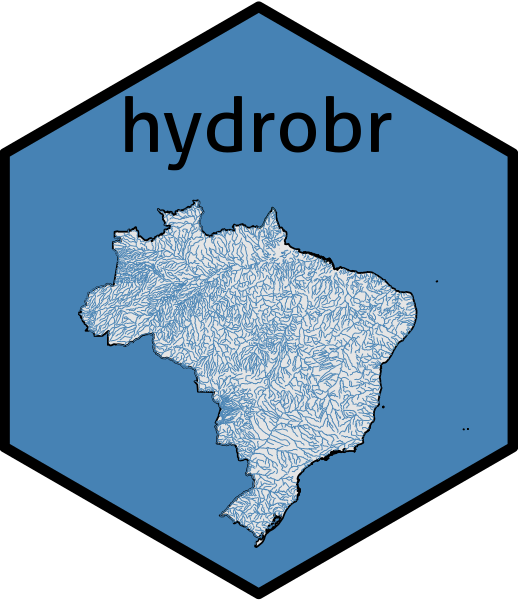

[](https://www.tidyverse.org/lifecycle/#experimental) 
[](https://choosealicense.com/)
# hydrobr 

## Installing this package
You can download and install the most up-to-date version directly from this repository. The procedure is
1. Install the package "devtools" - you only have to do this once. Note that this will also install several dependancies
2. Load the devtools library
3. Install the package.

The commands are:
``` R
install.packages("devtools")
library(devtools)
install_github("daniel-althoff/hydrobr")
```

## hydrobr package motivation
Os dados fluviométricos e pluviométriocos da Agência Nacional de Águas são uma das bases para modelagem de processos hidrológicos no Brazil. Esforços tem sido feito para aquisição e processamento desses dados, contudo há necessidade de concentração dos esforços de maneira produzir um software que tenha capacidade prover a cadeia de processamentos comumente realizados na modelagem hidrológica assim como ser continuamente aprimorado. Diante disso, lançamos o pacote hydrobr com sonho de ser um dos locais cujos hidrólogos possam concentrar seus esforços no desenvolvimento da hidrologia. O desenvolvimento do pacote é aberto à estusiastas. Caso tenha uma ideia entre em contato conosco. Faça parte da equipe e ajudenos a realizar esse sonho.


## Themes
This package contains functions which are grouped into themes. Currently the themes include:
- Access hydrological data (use the Brazilian National Water Agency API to download fluviometric and pluviometric data),
- Data manipulations (select stations, filter, check quality, missing data infilling),
- Visualization (data visualization, standardized plotting functions),
- Describe others in the future


## Coding standards
### General standards
The general coding standards are as specified in the Google R coding guide at https://google.github.io/styleguide/Rguide.xml.

### Devtools
To make package development easier, we will use the package **devtools**, which provides several tools. This package is explained at https://github.com/hadley/devtools.

#### Checking
The devtools check function will be used check each function for errors in syntax and style. Each function must pass the checks with zero warnings, errors or notes. Note that once you have loaded **devtools**, the check function can be accessed from a menu or from the build tab in Rstudio. It is also a good idea to manually run the **check** function from the command line, i.e. 
```R
R CMD check
```
as this can catch other problems.

#### Documentation
All functions need to be documented using the **Roxygen** package, which allows you to create the help files and documentation using comments in your function. The package is explained at https://cran.r-project.org/web/packages/roxygen2/vignettes/roxygen2.html. Rstudio has a very nice quick reference for **Roxygen** which you can access with Help|Roxygen Quick Reference.
Each function must include the name of the authors(s). Please include your email address, and any publications that you want to reference.
Note that the package itself also has a function. This contains documentation about the package as a whole, as well as settings which are used to create the package **NAMESPACE** file. Note that this means that the **NAMESPACE** file should _never_ be edited directly by anyone.
When the package is compiled and tested, **Roxygen** will create a .Rd file for each function, the package, and for the included data files. These files should never be edited manually. If you want to check how your .Rd file will look, you can load it into Rstudio, which can render it.

#### Vignettes
Vignettes are long form documentation which can be included in R packages. They can include long descriptions and worked examples, and are very useful to thoroughly explain functions to the users. The creation process is explained at http://r-pkgs.had.co.nz/vignettes.html. Even if you don’t write code, you can contribute to writing vignettes for functions.

#### Testing
The testthat package allows unit tests to be created for each function. The function is executed, using specified data, and the results are compared to specified values. Unit tests should be used whenever possible, as they will identify problems caused by changes in upstream packages. The testthat package is explained in detail in http://r-pkgs.had.co.nz/tests.html.

#### Test data
Each function is required to have an example, which should be executable code. The only exception should be for code which is intended to access data which may not be available, such as data downloaded from a server.
The example, vignettes, and unit tests will all require test data sets. The data are stored in the /data folder of the package, and should be stored as .Rdata (binary) files, unless reading in data from another format is the point of the function. CRAN has a maximum limit of 1 MB for test data, so we will need to minimise the datasets we include. We should minimise the size of each test dataset and re-use the same data in as many functions as possible. If a function requires data output by another function, both functions can be included in the example.
Each dataset needs to be documented in the same way as a function. The creation of datasets and their documentation is explained at http://r-pkgs.had.co.nz/data.html.


## Working with GitHub
There is a lot of information available on using git and GitHub in R. The best starting point is https://support.rstudio.com/hc/en-us/articles/200532077-Version-Control-with-Git-and-SVN which shows how to integrate git and GitHub with RStudio.


